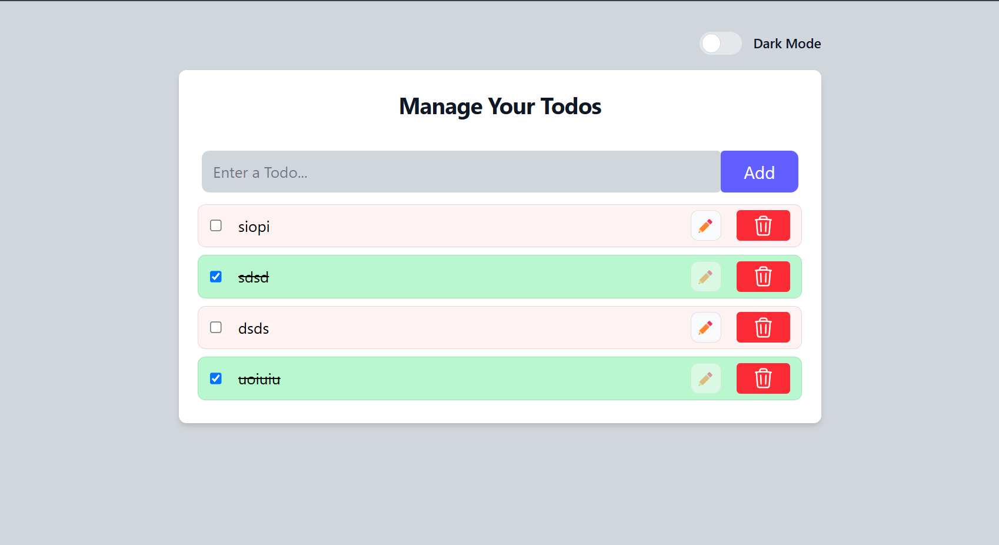
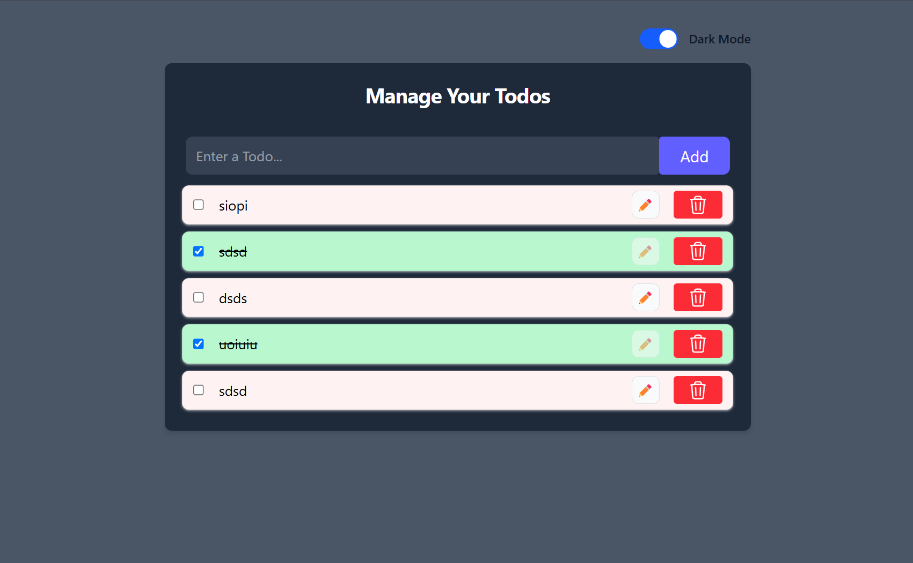

# Todo List Application

### A simple and efficient React & Redux powered Todo List application with local storage persistence and dark mode support.

## Features

* Add, edit, and delete todos

* Mark tasks as complete/incomplete

* Dark mode toggle for a better user experience

* Local storage integration to retain todos across sessions

## Technologies Used

* React – Frontend UI

* Redux Toolkit – State management

* Tailwind CSS – Styling

* LocalStorage – Persistent data storage

## Demo




## Setup Instructions

### Clone the repository:
```
git clone https://github.com/jbhavyadeep/todoReduxToolkit.git
cd todoReduxToolkit
```
### Install dependencies
```
npm install
```
### Run the development server
```
npm run dev
```
### Open http://localhost:5173 in your browser to see the app.

## Learning Outcomes
This project helped me strengthen:

* React Hooks (useState, useEffect)

* Redux Toolkit for centralized state management (useSelector, createSlice, configureStore etc)

* Local storage integration to persist data

* UI enhancements using Tailwind CSS

